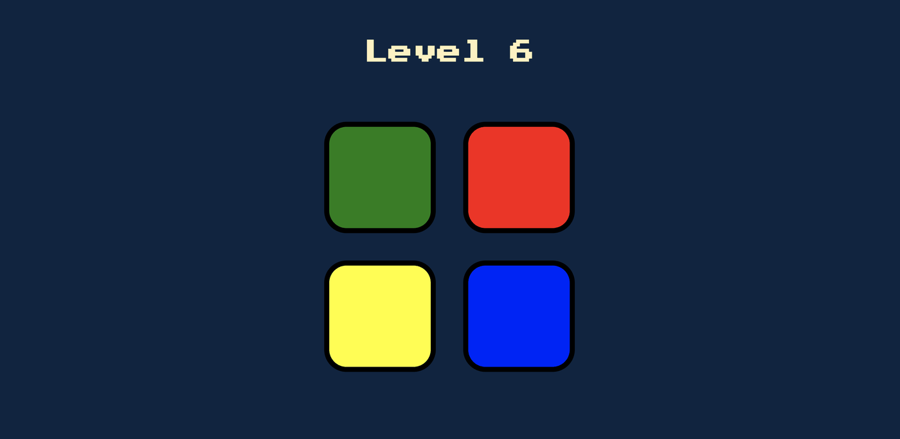
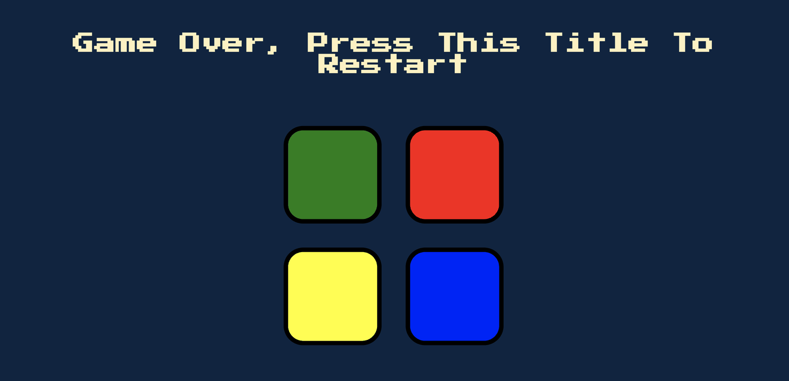
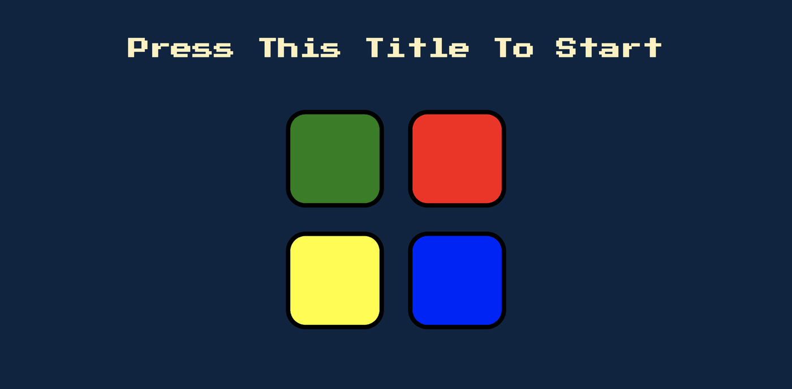

# Simon Says

A browser recreation of the classic memory game: watch the sequence, then repeat it back. Each round adds one more step.

**▶ [Play it here](https://marcopetru.github.io/Simon-Says-Game/)**



## About

Built while working through Dr. Angela Yu's *Complete Web Development Bootcamp* on Udemy, as a hands-on exercise in DOM manipulation and event-driven JavaScript — no framework, no game loop library, just the browser.

## How to play

Click the title to start. Watch the flash-and-sound sequence, then click the four panels back in the same order. Get it right and the sequence grows by one; get it wrong and it's game over.



## Built with

- **JavaScript** + **jQuery** for DOM manipulation and event handling
- HTML / CSS
- Web Audio (`<audio>`) for the four button sounds and the fail sound

## Repository contents

```
index.html    markup
styles.css    styling
game.js       game logic — sequence generation, input checking, sound/animation triggers
sounds/       button + game-over sound effects
```

## Screenshots

| Title | Gameplay | Game over |
| --- | --- | --- |
|  |  |  |
